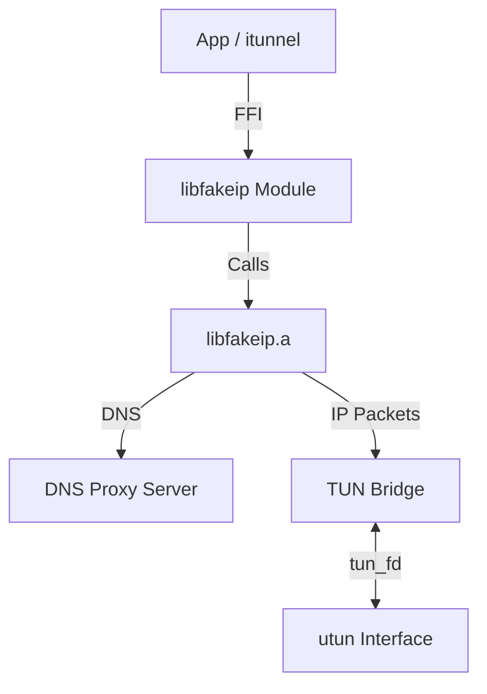

# LibFakeIP Integration Design

This document describes the design and usage of the `libfakeip` module in `itunnel`.

## Overview

`libfakeip` is a high-performance Rust library (compiled as a static library `libfakeip.a`) that handles:
1.  **DNS Hijacking**: Intercepts DNS queries and returns "Fake IPs" (198.18.0.0/15) for proxied domains.
2.  **NAT Mapping**: Maintains a mapping between Fake IPs and their original domains.
3.  **Rule Matching**: Determines which domains should be proxied based on rules (e.g., gfwlist).
4.  **TUN Bridge**: A zero-copy bridge that transparently handles IP packet transformation between the TUN interface and the application.

## Architecture



## Module Structure: `src/fakeip/mod.rs`

The module consists of two layers:
1.  **Low-Level FFI (`extern "C"`)**: Raw bindings to the library functions.
2.  **High-Level Wrapper (`FakeIP`)**: A safe Rust API that handles C-string conversions, pointer management, and type safety.

## Key APIs

### Initialization & Lifecycle
- `FakeIP::init()`: Initializes the internal runtime and global state.
- `FakeIP::cleanup()`: Gracefully shuts down threads and frees memory.

### DNS & IP Mapping
- `FakeIP::get_fake_ip(domain: &str) -> Option<String>`: Retrieves an existing Fake IP or allocates a new one for the domain.
- `FakeIP::get_domain_by_ip(ip: &str) -> Option<String>`: Reverses the mapping to find the domain for a given Fake IP.

### Rules Engine
- `FakeIP::load_rules(path: &str)`: Loads rules from a file (GFWList format).
- `FakeIP::match_domain(domain: &str) -> bool`: Checks if a domain matches the loaded rules.

### Networking
- `FakeIP::start_dns_proxy(port: u16)`: Starts the internal DNS server to intercept queries.
- `FakeIP::start_bridge(tun_fd: i32)`: Spawns bridge threads to process packets from the TUN interface.

## Integration in `itunnel` (macOS Lifecycle)

To use `libfakeip` in the main application according to the architecture modeled in `iedux`, follow these steps:

```rust
use itunnel::fakeip::FakeIP;

fn setup_vpn(is_global_proxy: bool) {
    // 1. Initialization
    // Use an absolute path for logs in macOS to avoid App Bundle write permissions issues (codesign breaks otherwise)
    FakeIP::init(); // Alternatively with log configuration if extended
    
    // 2. Load rules
    FakeIP::load_rules_str("...gfwlist content...");

    // 3. Create TUN interface (usually via wireguard go core FFI)
    // Here wg_create_tun will return a File Descriptor (tun_fd)
    let tun_fd = wg_create_tun("utunX");
    
    // 4. Configure OS network components (macOS system commands)
    // a. `ifconfig utunX inet <Virtual_IP> <Virtual_IP> netmask 255.255.0.0`
    // b. Add routing to Fake IP block: `route add -net 198.18.0.0/16 -interface utunX`
    // c. Route specific IPs to TUN (e.g., Google DNS 8.8.8.8) to intercept DNS: `route add -net 8.8.8.8/32 -interface utunX`
    // d. If global mode: add `0.0.0.0/0` to `utunX` and bypass local/RFC1918 networks directly to the primary gateway.

    // 5. DNS configuration for macOS
    // a. Read the active network service using `networksetup -listallhardwareports`.
    // b. Set DNS to our FakeIP bridge: `networksetup -setdnsservers <Active_Service> 198.18.0.1`
    // c. Flush OS cache: `dscacheutil -flushcache` and `killall -HUP mDNSResponder`

    // 6. Create bridge over `libfakeip`
    // The bridge returns a FD (`go_fd`) that we pass into wireguard instead of passing `tun_fd` directly.
    let go_fd = FakeIP::create_bridge();
    
    // 7. Start the bridge processing using the OS real `tun_fd`
    FakeIP::start_bridge(tun_fd);
    
    // 8. Set routing mode based on user's preference
    FakeIP::set_global_mode(is_global_proxy);

    // 9. Start WireGuard Backend mapping to `go_fd`
    // wg_turn_on(config_ptr, go_fd) -> This ties the WG tunnel to the Rust-based FakeIP bridge.
}
```

## Notes

- **Thread Safety**: The library is thread-safe and uses concurrent data structures (DashMap) internally.
- **Memory Management**: Strings returned from the FFI are automatically freed by the `FakeIP` wrapper using `rust_free_string`.
- **Global Instance**: The library manages a global singleton state, so `init()` should only be called once.
